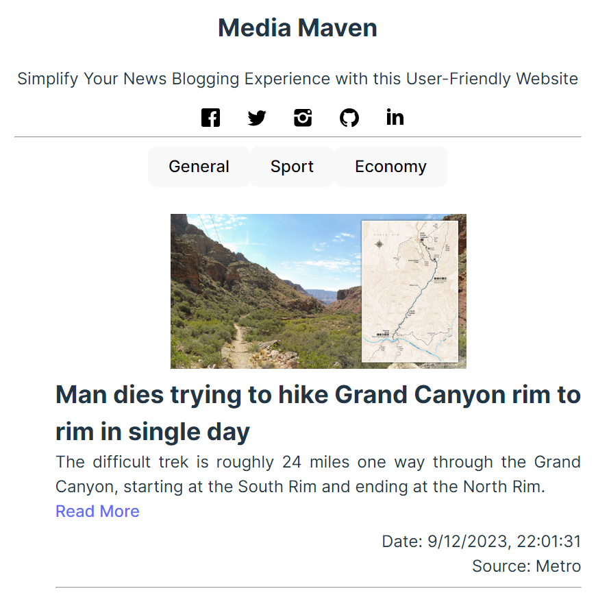

# Media Maven

Media Maven is a news application designed for residents of England. It allows users to access news articles in three categories: general, sport, and economy. This README provides information about the project's purpose, functionality, technologies used, installation instructions, and other relevant details.

## Table of Contents

- [Project Purpose](#project-purpose)
- [Functionality](#functionality)
- [Technologies Used](#technologies-used)
- [Installation](#installation)
- [Usage](#usage)
- [Screenshots](#screenshots)
- [Live Demo](#live-demo)

## Project Purpose

Media Maven is aimed at providing up-to-date news articles for residents of England. Users can easily navigate through different categories to stay informed about general news, sports events, and economic developments. It offers a user-friendly interface for a seamless news browsing experience.

## Functionality

- Access news articles in three categories: General, Sport, and Economy.
- Stay informed about the latest news, including headlines, descriptions, publication dates, and sources.
- Click on articles to read more and view the full content on external websites.

## Technologies Used

The project is built using the following technologies:

- React: A popular JavaScript library for building user interfaces.
- Vite: A fast development build tool and server with hot reloading.
- Axios: A promise-based HTTP client for making API requests.

## Installation

To run Media Maven on your local machine, follow these steps:

1. Clone the project repository:

   ```bash
   git clone https://github.com/your-username/news-app.git
   ```

2. Navigate to the project directory:

   ```bash
   cd news-app
   ```

3. Install project dependencies using [PNPM](https://pnpm.io/):

   ```bash
   pnpm install
   ```

4. Start the development server:

   ```bash
   pnpm dev
   ```

   This will launch the application in watch mode, allowing you to view it in your web browser at `http://localhost:5173`.

## Usage

1. Open the application in your web browser.

2. Select one of the available categories: General, Sport, or Economy.

3. Browse through the list of news articles, read headlines, descriptions, and check publication dates and sources.

4. Click on any article to read the full content on the external news website.

## Screenshots

Page One:



Full View:


## Live Demo

https://news-app.nikenhpsr.site/
